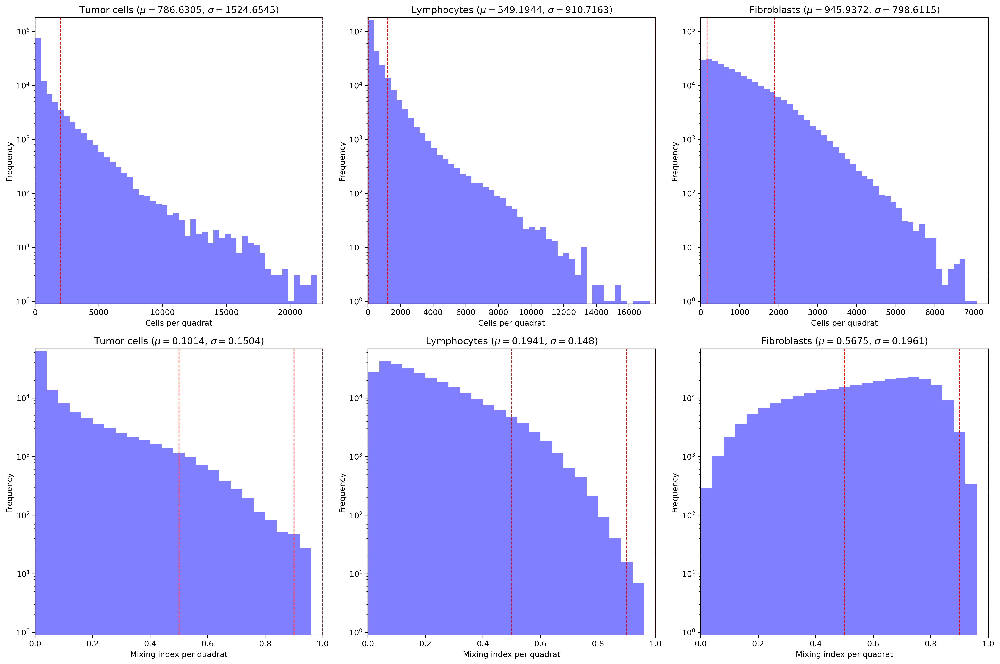

# Tumor Landscape Analysis (TLA)
 
 
## TLA pipeline user guide

TLA is a python program that computes an extensive set of spatial statistics, implementing functions from the landscape ecology package [pylandstats](https://github.com/martibosch/pylandstats), astronomical and GIS point statistics ([astropy](https://www.astropy.org/), [pysal](https://pysal.org/esda/index.html)), spatial stratified heterogeneity ([geodetector](https://cran.r-project.org/web/packages/geodetector/vignettes/geodetector.html)) and image processing methods ([scipy](https://scipy.org/), [scikit-image](https://scikit-image.org/)).

The main TLA pipeline is denoted as [`TLA_points`](#points), this is a point-level analysis for cell coordinate data. Additionally, TLA includes a simplified pipeline, called [`TLA_regions`](#regions), for studies in which the initial data provided for the analysis are only segmentation profiles of tissue components, instead of cell-level coordinates. This simplified analysis collects landscape ecology metrics only, skiping all point-statistics, and focuses on regional analyses. 

Novel aspects are of significance in TLA:

1. Point statistics are calculated both globally and locally. The first case provides a single index for each sample while the second provides a spatial profile that shows the variations of a given measure across the area of the sample. Local profiles are generally done using a quadrat approach.
2. Quadrat smoothing inherently reduces the resolution of the landscape, as any feature with a length scale smaller than the size of a quadrat can't be resolved, and data is binned accordingly. Adopting the principle of spatial smoothing from image processing, TLA uses spatial convolution functions with a gaussian kernel instead of a quadrat grid. This approach allows for statistics to be calculated at full pixel resolution, maintaing fine details of the tissue architecture in the context of the corresponding metric being measured. 
3. Local microenvironment categories can be defined using local spatial profiles. This methodology creates a clasification scheme that identifies regions in the tissue "landscape" corresponding to distinct patch classes, and which can be used in a landscape ecology fragmentation analysis.
4. In a similar way, spatial profiles can be used to generate patches by segementing them into contour levels according to the index value assigend to each pixel. Using contour levels as patches allows for their analysis using landscape ecology methods, which provides with a way to characterize and compare the profiles themselves (i.e. turning a two-dimensional surface profile into single indeces representing configuration properties of the profile).


---
---

# <a name="points"></a> Point-level analysis

The pipeline `TLA_points` is a set of modules that processes point-level data. The expected input for each sample is a table of centroid coordinates and a type category label (class) for each cell. 

For information about `TLA_regions` go [here](#regions)

## <a name="points_conf"></a> Configuration files

### The argument table

This is a comma separated file (CSV) containing the main arguments for all TLA modules, and it must be generated by the user. The example `test_set.csv` is provided in this repository as a template. 

Typically this table has only one row, containing argument values for a single study. A study includes a number of biopsies to be analyzed and compared together. TLA allows for batch processing of multiple studies if several rows are added in this table. In this case, please notice that the assumption is that there is no connection between different studies, so no comparisons or joined statistics will be calculated between them. But in general, this approach is not recomended, since some modules might take a few attempts to get all samples processed, and it will be cumbersome to do this is a batch-mode. Instead, it is preferable to produce a separate argument tables for each study and run them independently. 

The arguments for a study are:

1. {`name`}: (str) name to identify the study. 
2. {`raw_path`}: (str) path to the location of the study raw data. This folder is assumed read-only by TLA.
3. {`raw_samples_table`}: (str) name of raw samples table (CSV). This table has all the relevant information for each individual sample in the study. 
4. {`raw_classes_table`}: (str) name of classes table for cells in this study. 
6. {`data_path`}: (str) path to the location for TLA output. Please make this path different than `raw_path` to secure your original data. 
7. {`scale`}: (float) scale of pixels in physical units (units/pixel)
8. {`units`}: (str) name of physical units (e.g. `[um]`) 
9. [`factor`]: (float, default=1.0) value of a scaling factor for reducing pixel resolution (to save memory). The scale is then adjusted as $s = s'/f$ (with $s$ the new scale, $s'$ the original scale (units/pixel) and $f$ the factor). It's advisable to play with factor scaling to optimize computational performance, but `scale` is set by experimental design conditions. Therefore these two arguments are kept separated for clarity. 
10. {`binsiz`}: (float) approximte size in [`units`] of quadrat (kernel) binning for coarse graining and convolution calculations. Actual value in pixels is rounded to clossest multiple of 10. This is the long scale bandwidth. The short scale bandwidth is set to 1/20th of this one. 
11. [`FILTER_CODE`]: (str) code of targeted cells for density filtering (typically tumor or epithelial cells)
12. [`HIGH_DENS_CODE`]: (str) code assigned to targeted cells in high density areas (and inside regions of interest defined by the blob mask)
13. [`LOW_DENS_CODE`]: (str) code assigned to target cells in low density areas (or outside regions of interest defined by the blob mask)
14. [`DTHRES`]: (float, defaults=0) threshold for filtering target cell-type according to cell density. Cells of `FILTER_CODE` with density lower than this value are reclassified as `LOW_DENS_CODE` and `HIGH_DENS_CODE` otherwise. A value of 0 turns this feature off.
11. [`BLOBS`]: (bool, default=False) If `TRUE` then a mask image with _ad hoc_ regions of interest will be used to mask cells. In this case cells of `FILTER_CODE` type that outside of blobs are reclassified as `LOW_DENS_CODE` and those inside blobs are reclassified as `HIGH_DENS_CODE`.  

Fields named between square brakets "[...]" are optional. But some are conditional. For instance, if `BLOBS` is set to TRUE, or `DTHRES` is a value larger than 0, then TLA will expect values for all `FILTER_CODE`, `HIGH_DENS_CODE` and `LOW_DENS_CODE`.
TLA will stop, with an error message, if any required information is missing. 

### Samples table

The argument `raw_samples_table` points to a table of sample information located in the `raw_path` folder, with the following variables (columns) for each sample (rows):

1. [`index`]: (int) index value.
2. {`sample_ID`}: (str) unique identifier for each sample.
3. {`coord_file`}: (str) name of the coordinate file (CSV) for this sample. These are raw coordinates that will be curated during pre-processing. __ATTENTION:__ The format of this file __must be__  `['class', 'x', 'y']`, with these _exact_ column names; any additional info in this file (like annotations for each cell) will be ignored. Cleaned out data files are cached to be used in downstream analysis (including the additional info). BUT only cell classes defined in the classes table and cells that pass the filtering process are kept. Also for practical convenience coordinate values are reset to new margins.
4. {`split_rois`}: (bool, default=False) If `TRUE` then more than one sample per slide is expected. Split is done using labeled mask contained in `roi_file`. 
5. [`roi_file`]: (str) Name of file with ROI mask for each sample. This field on the table is populated when the files are generated by `tla_slide_splits.py`. So this field is not required before that step.
6. [`image_file`]: (str, default = '') location and name of the image file for this sample (eg. H&E images). These images are adjusted to match coordinates of the coordinates convex hull, and copies are cached. If an image is not available, ignore or leave field blank. Only used for display in a few output graphics.
7. [`mask_file`]: (str, default = '') location and name of the corresponding mask file for this sample. Mask are used to identify large scale regions (blobs), like ducts, crypts, DCIS, different tissue components, etc. It can be either a binary mask or a raster image with integer labels identifying different blob patches. These images are also adjusted and cached. If a mask image is not available, ignore or leave field blank. _ATTENTION:_ This field will be required if the parameters `BLOBS` is set to true in the study arguments. 
8. Additional variables, like clinical annotations and/or sample details, will be carried over to result outputs and accessible to post-processing analysis.

### Classes table:

The argument `raw_classes_table` points to a table of cell categories with the following fields:

1. {`class`}: (str) unique identifier for each class, must be the same labels used in `coord_file` data files. 
2. {`class_name`}: (str) human readable name for each category, to be used in plots
3. {`class_color`}: (str) pre-chosen color for displaying each class
4. {`drop`}: If `TRUE` then this class will be dropped from the analysis.


## <a name="roi"></a> Generating ROI masks

Before running TLA it is necessary to generate labeled mask identifying the Region of Interest (ROI) for each sample. This process is done using a python script, `tla_slide_splits.py`. This python script opens a GUI app displaying data and clickable bottons that help select ROI masks for each slide. If the setting in samples table is `split_rois==TRUE` then this application prompts the user select up to two separate samples in that slide. In this case the data corresponding to each sample will be written out in separate data structures during TLA setup. Otherwise the only change to the data is that cells outside of the selected ROI mask are filtered out. 

ROI masks are generated and saved in a compressed numpy file (`.npz`) with the name specified in the samples table.

To launch `tla_slide_splits` use the following command:

```
> python src/tla_slide_splits.py {argument table}
```

It is possible that some samples don't have good enough data, e.g. the classification algorithm didn't pick up enough cells. In this case, the user can proceed without selecting any ROI mask and this sample will be dropped from the analysis in the setup stage.


## Using the `TLA_points` wrapper script

This is a bash script that handles all modules of the TLA.  

Usage: 

```
> ./TLA_points.sh [-s][-g][-r] {action} {argument table} 

``` 

where the optional switches are:

* `-s` for deploying TLA in __slurm__ mode. TLA uses `sbatch` to run analysis in a SLURM array. The script will launch and slurm array to run different samples in parallel. In this case the script is run from the login node and it will request multiple nodes using __sbatch__ scripting functionality.  
* `-g` for setting the __graph__ mode. With this option TLA graphs all detailed plots for each sample. This is recommended only for inspection of individual cases in post-analysis. 
* `-r` for __redo__ mode. TLA re-do all calculations from scratch. Otherwise, it skips samples already analyzed, and it uses cached data to finish analysis in samples that did not complete. Some calculations are computationally costly, this behaviour allows for a more efficient process when analyzing a large cohort of data, or big-data samples.


There are six possible actions that launch different TLA modules:

1. [`setup`](#points_setup_sum): runs the setup module for pre-processesing data. This includes data filtering, formating and calculations of global statistics.
2. [`setup_sum`](#points_setup_sum) do study-level summarizations after setup. Including stats required for the construction of LME categories. 
3. [`run`](#points_run) runs the main TLA analysis module, including calculation of local spatial statistic profiles and patch analysis using defined LMEs. Also patch, class and landscape -level statistics are performed for each sample 
4. [`run_sum`](#points_run_sum) does a final summarization of results, collects and consolidates sample tables for study-level analyses. 
5. [`ssh`](#points_ssh) runs spatial stratified heterogeneity analysis module, using previously calculated spatial statistic factors. 
6. `clean` deletes study folder with all analysis results (__NOTE__ only use if you are certain calculations need to be redone)

__Note 1:__ When running a full analysis, after preparing the data in the format and structure required (please read [Configuration files](#points_conf)), the appropiate sequence of actions is to follow steps 1-5 as described above (`clean` is only used if you need to delete results). 

__Note 2:__ Working is a SLURM array system, depending on the amount of resources available to the user, it could be inconveninet to request a large amount of memory or computing time per node. This is particularly relevant if the number of samples is large, as the total amount of requested resources adds up. Therefore it is always advisable to start low, and then request more resources for samples that failed. TLA keeps track of samples that are finished and skip them during a re-run. It also caches partial progress and picks up the analysis from there when launched again for that sample. 


Details for each module operation are shown bellow.

### <a name="points_setup"></a> 1. Setup Module

This module prepares data for TLA according to parameters in the argument table.
Pre-processesing includes cell filtering and data formating, creation of raster arrays, calculation of global spatial statistics and generation of profiles for cell density and mixing, which are later used to construct local microenvironment categories (LME) consistent across all samples.

Usage example: 

```
> ./TLA_points.sh [-s][-r][-g] setup test_set.csv

```

In the main data directory (`data_path`) this script records a new sample table with pre-processed file names and path locations. The fields are the same as the original sample table plus the following fields:

1. `results_dir`: directory where analysis results for each sample are recorded
3. `num_cells`: total number of points in the sample (after filtering)
4. `shape`: size of tissue landscape in pixels: _[num rows, num cols]_
5. `setup_runtime`: this field shows the runtime taken by this step in each sample 
6. `setup_maxMBs`: this field shows the maximum amount of memory used in this step in each sample 

__Note:__ for each study a table of approved classes is saved. This table includes limits for cell [abundance and mixing profiles](#abumix and mixing scores:); these limits can be modified manually before running the TLA analysis. allowing for customization in the definition of LME categories. 

#### 1.1 Notes about cell filtering:

Filtering re-assigns categories to cells found in regions where they are not expected (which indicates that they were likely misclassified). 

* Pre-processing separates a specific class of __target__ cells, denoted by the argument `FILTER_CODE` (e.g. tumor cells), into two separate classes according to their local density. For instance, tumor cells are not typically expected to be found in very low densities. So if they are observed in low densities, they probably were misclassified (i.e. false positives).
* The parameter `DTHRES` is the density threshold, in units of cells per pixel, to select high density cells (`DTHRES=0` sets this feature off). target cell in regions above `DTHRES` are re-classified with `HIGH_DENS_CODE` and cells in lower density regions are reclassified with `LOW_DENS_CODE`.
* Additionally, if an additional tissue compartment mask (i.e. blob mask) is provided (e.g., segmented ducts, crypts or other tissue compartments where tumor cells are expected to exist), set `BLOBS=True` to use these as the filter. In this case, target cells inside the masked blobs will be assigned as `HIGH_DENS_CODE` and the ones outside will be assigned `LOW_DENS_CODE`. 
* If __both__ filter features are set, then blob filtering takes precedence, so the density filtering is applied only inside blob regions, while all target cells outside the blobs are set to  `LOW_DENS_CODE` regardless of their density profile.

Density filtering is done using a Kernel Density Estimator (KDE) algorithm, which is a spatial convolution function to estimate local point densities. 


#### <a name="abumix"></a> 1.2 Local abundance and mixing scores:

The study parameter `binsiz` defines a "quadrat" size that is used to coarse grain the landscape mosaic for local properties of cell abundance and uniformity of spatial distribution (mixing). In field ecology, quadrats are typically used to quantify small regions and produce spatial profiles across a landscape. Using this same principle we grid our landscape and count the abundance _N<sub>c</sub>_ of each cell type _c_ in each quadrat, as well as the value of a mixing index for each cell type, defined as:
$$M_c = \frac{2 \cdot\sum{n_i \cdot m_i}}{\sum{(m_i)^2} + \sum{(n_i)^2}} = \frac{2}{1 + (L/N_c^2)\sum{n_i^2}}$$

Calculated over _L_ sub-quadrats which are 5 times smaller that the quadrats (and thus _L_=25). This is a univariate version of the Morisita-Horn score ([Horn, 1966](https://www-jstor-org.ezproxy1.lib.asu.edu/stable/2459242)) comparing the observed spacial profile of cell counts _n<sub>i</sub>_ with an array of the same size and a uniform distribution _m<sub>i</sub>_ = constant and 
$$N_c=\sum{n_i}=\sum{m_i}$$

This score is a simple way to account the degree of mixing (uniformity) of cells in a sample. A value _M<sub>c</sub>_ ~ 0 means that the sample is highly segregated (ie. variance across sub-quadrats is large) and a value _M<sub>c</sub>_ ~ 1 means that all sub-quadrats have very similar count values and thus, cells are uniformly distributed across the quadrat.

### <a name="points_setup_sum"></a> 2. Setup-summary Module

This module does a number of sumarizations of the preprocessed data.
In particular, abundance and mixing profiles are aggregated for all the data that was pre-processed, in order to get study-level distributions of values. These results are tabulated in the output `{study}_quadrat_stats.csv`. 
Also a result sample table is created (`{study}_samples_stats.csv`), tabulating global 1st order statistics, like number of cells and total lanscape area, and all posible bi-variate global 2nd order point statistics combinations. 

Usage example: 

```
> ./TLA_points.sh [-s] setup_sum test_set.csv
```

Aditionally, a file `{study}_analyses.csv` is created, consisting of a table of all possible combinations of classes for each point statistic metric. This table is read by downstream modules to select desired analyses for local spatial profiles. These are costly calculations and it is advisable to edit this table to customize the type of analysis done. The default includes all possible combinations in each case.

#### <a name="lme"></a> 2.1 LME classes construction

The `{study}_quadrat_stats` plot saved into the data folder for the study shows distributions of quadrat-level values for cell density and mixing score across all samples in the study. Red lines correspond with the limits presented in the class table. 



In the case of cell abundance, the edges are automatically picked at quantiles __[0.0, 0.5, 0.87, 1.0]__ while mixing index edges are picked at quantiles __[0.0, 0.5, 0.9, 1.0]__. __These are totally arbitrary values and it is recommended to check the distribution plots to confirm and adjust to proper values according to the interest in the research study__. TLA expects three levels, representing low, medium, and high values for each of these variables in each class, yielding 9 categories per cell class. For a study with 3 or more cell types this corresponds to hundreds of unique categories, which is not very practical.

For simplicity, LME classes are defined in three general categories for each cell type, encompassing both the abundance and mixing levels in the local region of study:

<div align="center">

</div>


1. __(B) Bare__ environments are those with few cells, regardless of mixing.
2. __(S) Segmented__ environments are those in which cells are clustered together or not well dispersed (moderate to high abundance and low mixing).
3. __(M) Mixed__ environments are those where cells are mixed uniformly (moderate to high abundance and high mixing).

Because the mixing score is sensitive to low abundance, typically understimating the mixing score if the abundance is low, then medium abundance levels are considered "mixed" (_M_) if mixing is at medium level.

With is scheme, __(B,S,M)__ codes are assigned for each individual class, forming categories like: `BBB, BBS, BBM …. MMM`. Each of these categories represent a basic type of Local Micro-Environment that is consistent across the entire study, and is used to define ecological phenotypes (patches) in the TLA.

__Note:__ TLA is focused on analysing samples independently. But the default definition of LME categories uses study-level sumarizations. Such definitions can be customized by the user by editing the classes file `<study_name>/data/<study_name>_classes.csv` in the study data folder created during `setup_sum`. This customization is done by adjusting cut-off values of `abundance_edges` and `mixing_edges` defining the low/medium/high levels used for LME construction. 

### <a name="points_run"></a> 3. Run Module

This is the main module of TLA were local point statistics profiles, LME profiling and fragmentation analyses are done. Study-level statistics are also generated, including a `_samples_stats.csv` with sumarized results of patch and class -level statistics for each sample. Results are recorded in separate folders for each sample within the study data directory.

Usage example: 

```
> ./TLA_points.sh [-s][-r][-g] run test_set.csv

```

### <a name="points_run_sum"></a> 4. Run-summary Module

This module does final sumarizations of results calculated in `TLA_run`.
Results generated for each sample are consolidated and tabulated in sample tables that can be used for a cohort analysis. 

Usage example: 

```
> ./TLA_points.sh [-s] run_sum test_set.csv
```

### 4. SSH Module 

This module runs Spatial Stratified Heterogeneity analysis for all the different spatial statistic factors produced in `TLA_points`, as well as their interactions and risk assessments in relation to their combinations. 

In principle, this analysis is done for LME patches, but this is not really a very interesting result, as LMEs are defined by abundance/mixing, and all the spatial factors (so far) implemented in TLA are based on some form of intermixing or colocalization of cell types. Therefore, this is a redundant analysis if done in this way.

But when _ad hoc_ blobs (eg. pre-defined regions like ducts, crypts or DCIS) are available, we have an __additional__ patch definition that can be interesting to test in the SSH method. This will tell us is any of the spatial factors stratify with respect to these tissue structures. If blob masks were included in the pre-processing step, this program will automatically generate these analyses, otherwise, it's done only for the LME patches.
 
Usage: 

```
>./TLA_points ssh test_set.csv
```


### TLA result outputs

Sample-specific results are recorded in `results/samples/` in the data folder, in subfolders named with its unique identifier of each sample. Here are descriptions of these output files:

1. `_samples.csv` row of values for this sample in the samples table
2. `_samples_stats.csv` row of values for this sample in the global statistics table
3. `_summary.txt` text file with general information for each sample 
4. `_Ripleys_H_function.csv` is a table of values of the Ripley's H function score for different radii scales. Values added in summary tables are the corresponding to the smalest radious.
5. `_quadrat_stats.csv` is a table of values for abundance and mixing scores in each quadrat of the sample. 
6. `_classes.csv` table with general class-level statistics
7. `_lme_tbl.csv` table of landscape-level fragementation statistics for the patch distribution given by the LME profile.

If the graphic output option is set (`-g`) these are the images produced:

1. `_landscape.pdf` shows a summary graph of the sample
2. `_simple_landscape.pdf` show summary images for each cell class
3. `_landscape_points.pdf` shows a scatter map of the landscape
4. `_landscape_classes.pdf` shows a scatter map for separate cell classes
5. `_abu_mix_landscape.pdf` show abundance/mixing profiles for all cell classes

Inside the `space_factors/` folder results the point-statistics analysis, and patch analysis of point-statistics local profiles (factors) are recorded:

1. `_rhfunc_stats.csv` table of properties of the __Ripley's H Function score__
2. `_nndist_stats.csv` table of properties of the __Nearest Neighbor Distance metric__
3. `_hots_stats.csv` table of properties of the __Getis Ord Gi* / HOT score__
4. `_coloc_stats.csv` table of properties of the __Colocalization index__
5. `_abu_stats.csv` table of properties of the abundace profiles
6. `_mix_stats.csv` table of properties of the mixing profiles

If the graphic output option is set (`-g`) for each factor included in the analysis there is a `_landscape.pdf` graph figure showing a representation of the local profile and histograms showing the coverage of each contour-level in it. Plots of correlations between all factors are also produced.

Inside the `lme/` folder results the patch analysis on LME profiles are recorded:

1. `_lme_patch_metrics.csv` a table of patch-level statistics 
2. `_lme_adjacency_odds.csv` is a table with von Neumann adjacency odds, reflecting the frequencies of pixel adjacencies and the odds of each type of them (the odd is the total number of adjacency events normalized by the total number of pairs, which is four times the number of pixels of each type)
3. `_lme_class_metrics.csv` a table of class-level statistics
4. `_lme_landscape_metrics.csv` a table of landscape-level statistics

If the graphic output option is set (`-g`) some graphs will be generated:

1. `_lme_landscape.pdf` is a map of the landscape with color-coded regions
2. `_lme_distribution.pdf` shows a bar plot of pixels per region class.
3. `_lme_class_coverage.pdf` shows pie charts for class coverage and number of patches.
4. `_lme_class_metrics_hists.pdf` shows bar plots for a number of class-level metrics
5. `_lme_patch_metrics_hists.pdf` shows distribution of values for a number of patch-level metrics
6. `_lme_adjacency_odds.pdf` is a heatmap representation of the adjacency odds. 

Aditionally, sample sumarization tables are saved in `results/space_factors` that include summary tables (`tbl.csv`) for each of the profile factors, and in the `results/lmes/` folder the summary for LME profiles. 

-

## Direct use from python

TLA scripts can be run directly from python, this is an option when the `bash` or `zsh` command interpreters are not available (eg Windows PC systems). In these cases use the option `--graph` if you want to plot all graphs for each sample,  `--redo` if you want to redo the analysis. The two __required__ arguments `{argument table}` and `{case}` indicate the name of the argument `.csv`file and the sample case to analyze (given as the zero-based index of the sample of interest in the corresponding samples table) 


### 1. The `TLA_points setup` module


* For a single sample with index `{case}` use: 

```
> python src/tla_points_setup_sample.py {argument table} {case} [--graph] [--redo]
```

* The setup-summary script is done __after__ all samples have been pre-processed:

```
> python src/tla_points_setup_sum.py {argument table}
```

* __For pre-processing the whole study__, it is recommended to use the scripts:

```
> src/tla_points_setup_loop.sh {argument table} [--graph] [--redo]
> src/tla_points_setup_sum_loop.sh {argument table} [--graph] [--redo]
```

which will run all the samples in a for-loop and then the summary. This is the serialized form of the TLA pipeline, and equivalent to running the bash scripts 

```
> ./TLA_points.sh [-g][-r] setup {argument table} `
> ./TLA_points.sh [-g][-r] setup_sum {argument table} `
```

### 2. To run `TLA run` module

* For a sample `{case}` use: 

```
> python src/tla_points_run.py {argument table} {case} [--graph] [--redo]
```

* The summary script will consolidate and summarize statistics across the whole cohort study __after__ all samples have been processed in TLA.

```
> python src/tla_points_run_sum.py {argument table}
``` 

* Or alternatively, __for processing the whole study__, it is recommended to use the script:

```
> src/tla_points_run_loop.sh {argument table} [--graph] [--redo]
> src/tla_points_run_sum_loop.sh {argument table} [--graph] [--redo]
```

which is equivalent to running the bash scripts:

```
> ./TLA_points.sh [-g][-r] run {argument table} `
> ./TLA_points.sh [-g][-r] run_sum {argument table} `
```

### 3. To run `TLA ssh` module

* For a single sample `{case}`, use the following instruction: 

```
> python scripts/tla_points_ssh.py {argument table} {case} [--graph] [--redo]
```

* __For processing the whole study__, it is recommended to use the script:

```
> src/tla_points_ssh_loop.sh {argument table} [--graph] [--redo]
```

which is equivalent to running the bash scripts:

```
> ./TLA_points.sh [-g][-r] ssh {argument table} `
```

## Direct use for SLURM

To directly use the `sbatch` scripts in a SLURM environment follow:

1. To run `TLA_points setup` module for all samples in the study in a SLURM array: 

```
> src/tla_points_setup_slurm.sh {argument table} [--graph] [--redo]
```
This runs the script `tla_points_setup_batch.sh` in a SLURM array for all samples,  setting up and launching SBATCH instances.

2. To run `TLA_points setup_sum` module for all samples in the study in a SLURM array: 

```
> src/tla_points_setup_sum_slurm.sh {argument table} [--graph] [--redo]
```
This runs the script `tla_points_setup_batch.sh` in a SLURM array. This module does not require parallelization, so it's done in a single node.

3. To run `TLA_points run` module for all samples in the study in a SLURM array: 

```
> src/tla_points_run_sbatch.sh {argument table} [--graph] [--redo]
```
This runs the script `tla_points_run_sbatch.sh` in a SLURM array for all samples,  setting up and launching SBATCH instances.

4. To run `TLA_points run_sum` module for all samples in the study in a SLURM array: 

```
> src/tla_points_run_sum_slurm.sh {argument table} [--graph] [--redo]
```
This runs the script `tla_points_run_sum_batch.sh` in a SLURM array. This module does not require parallelization, so it's done in a single node.

4. To run `TLA_points ssh` module for all samples in the study in a SLURM array: 

```
> src/tla_points_ssh_slurm.sh {argument table} [--graph] [--redo]
```
This runs the script `tla_points_ssh_sbatch.sh` in a SLURM array for all samples, launching SBATCH instances.

-----
-----

# <a name="regions"></a> Region-level analysis

The pipeline `TLA_regions` is a set of modules that processes region-level data. The expected input for each sample is a raster array with discrete values in each pixel representing tissue compartements. Therefore, the input is typically an array of labels or integer values corresponding to mapped out regions in the landscape.

For information about `TLA_points` go [here](#points)

## <a name="regions_conf"></a> Configuration files

### The argument table

This is a comma separated file (CSV) containing the main arguments for all TLA modules, and it must be generated by the user. The example `test_set_reg.csv` is provided in this repository as a template. 

Typically this table has only one row, containing argument values for a single study. A study includes a number of biopsies to be analyzed and compared together. TLA allows for batch processing of multiple studies if several rows are added in this table. In this case, please notice that the assumption is that there is no connection between different studies, so no comparisons or joined statistics will be calculated between them. But in general, this approach is not recomended, since some modules might take a few attempts to get all samples processed, and it will be cumbersome to do this is a batch-mode. Instead, it is preferable to produce a separate argument tables for each study and run them independently. 

The arguments for a study are:

1. {`name`}: (str) name to identify the study. 
2. {`raw_path`}: (str) path to the location of the study raw data. This folder is assumed read-only by TLA.
3. {`raw_samples_table`}: (str) name of raw samples table (CSV). This table has all the relevant information for each individual sample in the study. 
4. {`raw_reg_classes_table`}: (str) name of classes table for region types in this study. 
6. {`data_path`}: (str) path to the location for TLA output. Please make this path different than `raw_path` to secure your original data. 
7. {`scale`}: (float) scale of pixels in physical units (units/pixel)
8. {`units`}: (str) name of physical units (e.g. `[um]`) 
9. [`reg_factor`]: (float, default=4.0) value of a scaling factor for reducing pixel resolution to save memory. The scale is then adjusted as $s = s'/f$ (with $s$ the new scale, $s'$ the original scale (units/pixel) and $f$ the regional factor). It's advisable to play with factor scaling to optimize computational performance, but `scale` is set by experimental design conditions. Therefore these two arguments are kept separated for clarity. 
10. {`binsiz`}: (float) approximte size in [`units`] of quadrat (kernel) binning for coarse graining and convolution calculations. Actual value in pixels is rounded to clossest multiple of 10. This is the long scale bandwidth. The short scale bandwidth is set to 1/20th of this one. 

Fields named between square brakets "[...]" are optional.

### Samples table

The argument `raw_samples_table` points to a table of sample information located in the `raw_path` folder, with the following variables (columns) for each sample (rows):

1. [`index`]: (int) index value.
2. {`sample_ID`}: (str) unique identifier for each sample.
3. {`region_file`}: (str) Name of file with raster data on regional segmentation for this sample.
3. [`roi_file`]: (str) Name of file with ROI mask for each sample. This field on the table is populated when the files are generated by `tla_slide_splits.py`. So this field is not required before that step. 
4. [`image_file`]: (str, default = '') location and name of the image file for this sample (eg. H&E images). These images are adjusted to match coordinates of the coordinates convex hull, and copies are cached. If an image is not available, ignore or leave field blank. Only used for display in a few output graphics.
6. Additional variables, like clinical annotations and/or sample details, will be carried over to result outputs and accessible to post-processing analysis.

### Classes table:

The argument `raw_reg_classes_table` points to a table of cell categories with the following fields:

1. {`class`}: (str) unique identifier for each class, must be the same labels used in `coord_file` data files. 
2. {`class_name`}: (str) human readable name for each category, to be used in plots
3. {`class_color`}: (str) pre-chosen color for displaying each class
4. {`drop`}: If `TRUE` then this class will be dropped from the analysis.


## Generating ROI masks

Before running TLA it is necessary to generate labeled mask identifying the Region of Interest (ROI) for each sample. Please read [this section](#roi)) for more details. 

## Using the `TLA_regions` wrapper script

This is a bash script that handles all modules of the `TLA_regions`.  

Usage: 

```
> ./TLA_regions.sh [-s][-g][-r] {action} {argument table} 

``` 

where the optional switches are:

* `-s` for deploying TLA in __slurm__ mode. TLA uses `sbatch` to run analysis in a SLURM array. The script will launch and slurm array to run different samples in parallel. In this case the script is run from the login node and it will request multiple nodes using __sbatch__ scripting functionality.  
* `-g` for setting the __graph__ mode. With this option TLA graphs all detailed plots for each sample. This is recommended only for inspection of individual cases in post-analysis. 
* `-r` for __redo__ mode. TLA re-do all calculations from scratch. Otherwise, it skips samples already analyzed, and it uses cached data to finish analysis in samples that did not complete. Some calculations are computationally costly, this behaviour allows for a more efficient process when analyzing a large cohort of data, or big-data samples.


There are three possible actions that launch different TLA modules:

1. [`run`](#regions_run) runs the main TLA analysis module. Patch, class and landscape -level statistics are performed for each sample. 
2. [`sum`](#regions_sum) does a final summarization of results, collects and consolidates sample tables for study-level analyses. 
3. `clean` deletes study folder with all analysis results (__NOTE__ only use if you are certain calculations need to be redone)

__Note 1:__ When running a full analysis, after preparing the data in the format and structure required (please read [Configuration files](#regions_conf)), the appropiate sequence of actions is to follow steps 1,2 as described above (`clean` is only used if you need to delete results). 

__Note 2:__ Working is a SLURM array system, depending on the amount of resources available to the user, it could be inconveninet to request a large amount of memory or computing time per node. This is particularly relevant if the number of samples is large, as the total amount of requested resources adds up. Therefore it is always advisable to start low, and then request more resources for samples that failed. TLA keeps track of samples that are finished and skip them during a re-run. It also caches partial progress and picks up the analysis from there when launched again for that sample. 


Details for each module operation are shown bellow.

### <a name="regions_run"></a> 1. Run Module

This is the main module of TLA were fragmentation analyses are done. Study-level statistics are also generated, including a `_samples_stats.csv` with sumarized results of patch and class -level statistics for each sample. Results are recorded in separate folders for each sample within the study data directory.

Usage example: 

```
> ./TLA_regions.sh [-s][-r][-g] run test_set_reg.csv

```

### <a name="regions_sum"></a> 2. Summary Module

This module does final sumarizations of results calculated in `TLA_regions_run`.
Results generated for each sample are consolidated and tabulated in sample tables that can be used for a cohort analysis. 

Usage example: 

```
> ./TLA_regions.sh [-s] sum test_set.csv
```

### TLA result outputs

Sample-specific results are recorded in `results/samples/` in the data folder, in subfolders named with its unique identifier of each sample. The general tables saved are:

1. `_samples_reg.csv` row of values for this sample in the samples table
2. `_reg_tbl.csv` row of values for this sample in global statistics table
3. `_reg_classes.csv` table with general class-level properties

More specific results are saved in a `/regs` subfolder:

1. `_reg_patch_metrics.csv` a table of patch-level statistics 
2. `_reg_adjacency_odds.csv` is a table with von Neumann adjacency odds, reflecting the frequencies of pixel adjacencies and the odds of each type of them (the odd is the total number of adjacency events normalized by the total number of pairs, which is four times the number of pixels of each type)
3. `_reg_class_metrics.csv` a table of class-level statistics
4. `_reg_landscape_metrics.csv` a table of landscape-level statistics

If the graphic output option is set (`-g`) some graphs will be generated and saved in `/regs`:

1. `_reg_landscape.pdf` is a map of the landscape with color-coded regions
2. `_reg_distribution.pdf` shows a bar plot of pixels per region class.
3. `_reg_class_coverage.pdf` shows pie charts for class coverage and number of patches.
4. `_reg_class_metrics_hists.pdf` shows bar plots for a number of class-level metrics
5. `_reg_patch_metrics_hists.pdf` shows distribution of values for a number of patch-level metrics
6. `_reg_adjacency_odds.pdf` is a heatmap representation of the adjacency odds. 

Aditionally, sample sumarization tables are saved in `/results` that include:

1. `_reg_all_stats_table.csv` a table of general global measures for each sample.
2. `_reg_landscape_stats.csv` a comprehensive table with all landscape-level metrics for each sample, including sumarization statistics of patch-level metrics.
3. `_reg_classes_stats.csv` class-level statistics for all samples

---

## Direct use from python

TLA scripts can be run directly from python, this is an option when the `bash` or `zsh` command interpreters are not available (eg Windows PC systems). In these cases use the option `--graph` if you want to plot all graphs for each sample,  `--redo` if you want to redo the analysis. The two __required__ arguments `{argument table}` and `{case}` indicate the name of the argument `.csv`file and the sample case to analyze (given as the zero-based index of the sample of interest in the corresponding samples table) 

* For a single sample with index `{case}` use: 

```
> python src/tla_regions_run.py {argument table} {case} [--graph] [--redo]
```

* The setup-summary script is done __after__ all samples have been pre-processed:

```
> python src/tla_regions_sum.py {argument table}
```

* __For processing the whole study__, it is recommended to use the scripts:

```
> src/tla_regions_run_loop.sh {argument table} [--graph] [--redo]
> src/tla_regions_sum_loop.sh {argument table} [--graph] [--redo]
```

which will run all the samples in a for-loop and then the summary. This is the serialized form of the TLA pipeline, and equivalent to running the bash scripts 

```
> ./TLA_regions.sh [-g][-r] run {argument table} `
> ./TLA_regions.sh [-g][-r] sum {argument table} `
```

## Direct use for SLURM

To directly use the `sbatch` scripts in a SLURM environment follow:

1. To run `TLA_regions run` module for all samples in the study in a SLURM array: 

```
> src/tla_regions_run_slurm.sh {argument table} [--graph] [--redo]
```
This runs the script `tla_regions_run_batch.sh` in a SLURM array for all samples,  setting up and launching SBATCH instances.

2. To run `TLA_regions sum` module for all samples in the study in a SLURM array: 

```
> src/tla_regions_sum_slurm.sh {argument table} [--graph] [--redo]
```
This runs the script `tla_regions_sum_batch.sh` in a SLURM array. This module does not require parallelization, so it's done in a single node.
